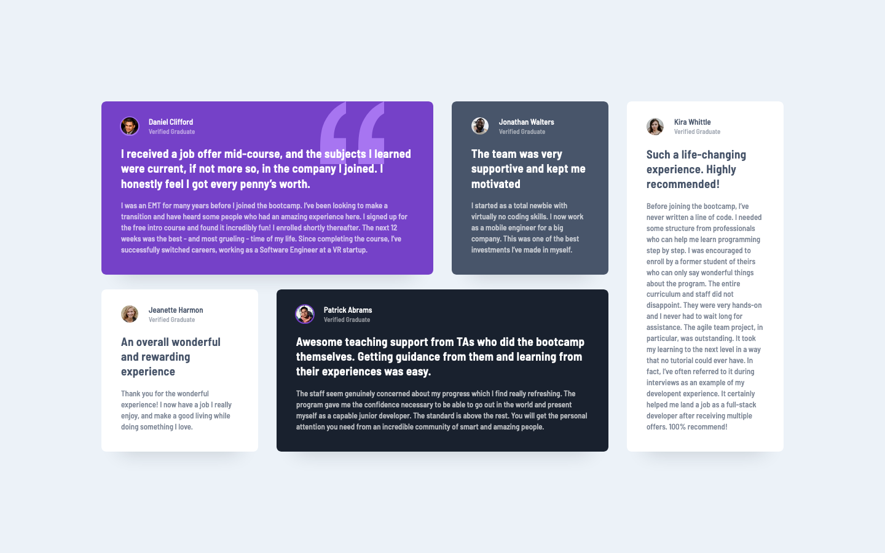

# Frontend Mentor - Testimonials Grid Section Solution

## The challenge

Users should be able to:

- View the optimal layout for the site depending on their device's screen size

## Screenshot

### Mobile

### Desktop

### Built with

- Semantic HTML5 markup
- CSS custom properties
- Flexbox
- CSS Grid
- Mobile-first workflow
- React

### What I learned

Not a particularly difficult challenge but it did give me the opportunity to use CSS Grid which I haven't touched for a while.